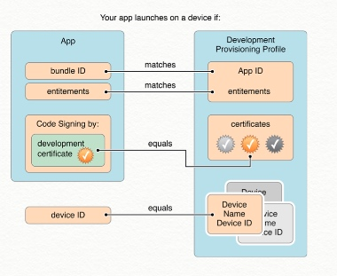
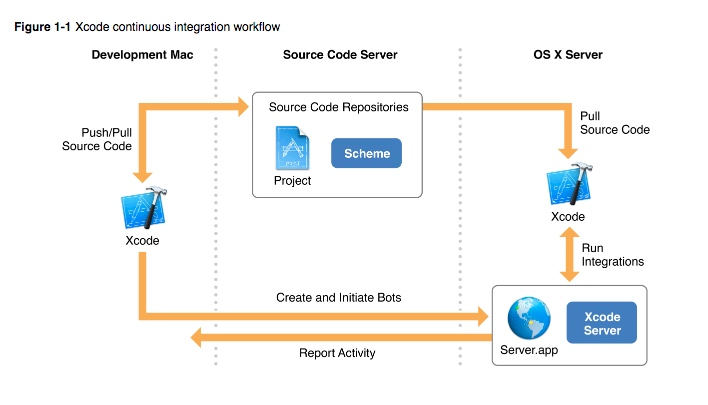

 # 证书 codesining + distribution + xcode server

## 基本概念（待完善）

### codesing + distribution

**App ID:**
**(device ID)UDID:**
**Certificate:**

- Development certificate: 用来开发和调试应用程序，最多能注册 2 个证书。 
- Distribution(Production) certificate: 主要用来分发应用程序（根据证书种类有不同作用），最多能注册 2 个证书。

用户可在网站上删除（Revoke）已注册的 Certificate，**XCode 9 之前提供了 Revoke 操作了，但在 XCOde 9 把这个功能给去掉了。**

上面证书都对应有自己的 provisioning file，一个 Provisioning file: 由 app id + UDID + certificat 组成。

1. xcode 8 ： automatic signing
2. xcode 9： use automatic to distribution （xcode builder + xcode server）

- code sign include 3 step?

    1. code signature is valid 
    2. allow to use system services
    3. allow to run in devices
    
    对应下面：
    
    1. certificate
    2. profile division
    3. entitlement

如果要打包到真机上运行一个APP，一般要经历以下三步：
* 首先，需要指明它的 App ID，并且验证 Bundle ID 是否与其一致；
* 其次，需要证书对应的私钥来进行签名，用于标识这个 APP 是合法、安全、完整的；
* 然后，如果是真机调试，需要确认这台设备是否授权运行该 APP。

问题：

1. 证书失效，为什么导致 app 打不开，本地的 provision file 会更新嘛???

### XCode server

苹果提供持续集成

automatic signing repair

never revoke distribution certificate anymore

- export will generate some file

1. your ipa
2. distributionsummary.plist
3. package.log
4. ExportOption.plist

## Distribution Signing with Xcode Server

