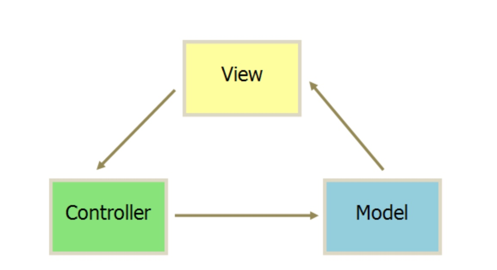
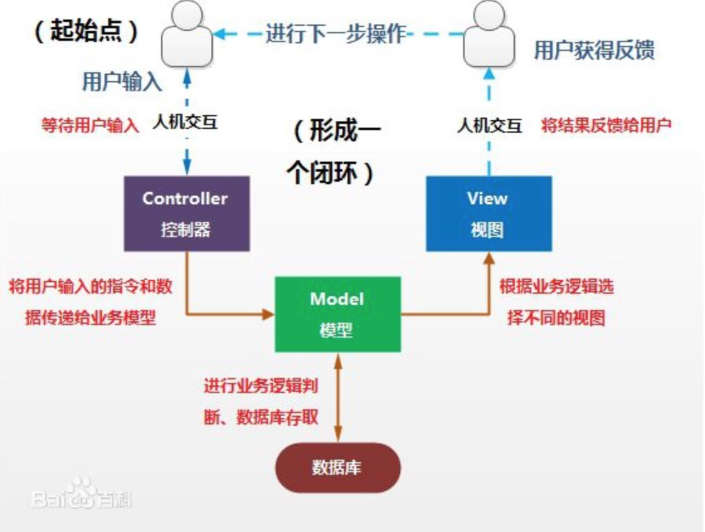
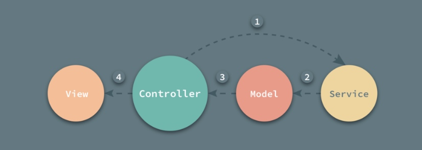
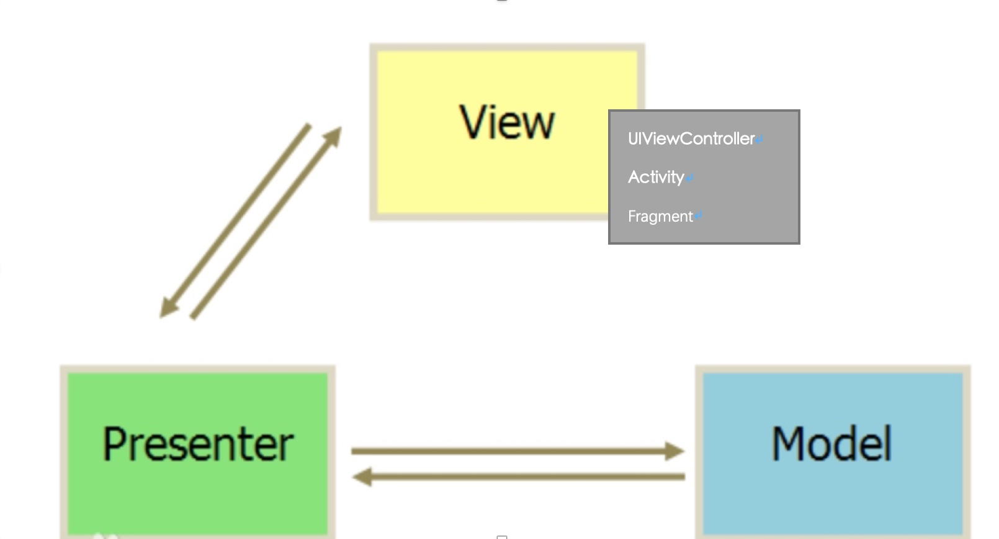

# 从 MVC 到 MVVM 的个人总结

## 分享的目的

在开发过程中有时候在编写代码的过程会变得很迷茫，一个是对工程架构疑惑还有就是设计结构。

1. 系统了解 MVC、MVP 和 MVVM。
2. 增强在项目中使用相关架构的意识。
3. 个人：学习架构知识，以此提高自己的知识水平。

## 问题

1. Model 到底要不要包含业务逻辑，真踏马让我困扰。
2. 业务逻辑要怎样抽离？
3. Controller 要处理的业务逻辑是什么？

## 正文

### MVC 

M - Model 业务模型
V - View 视图 （用户界面）
C - Controller 控制器（业务处理）

**他们之间的关系如下**

**早期我理解的 MVC （web）**

 

当时的 Model 只是一个模型数据，不包含逻辑处理。只是一个数据库中表中的映射模型。

**移动端**

> iOS MVC
`Model` = What your application is (but not how it is displayed)
`Controller` = How your Model is presented to the user (UI logic)
`View` = Your Controller’s minions
>

**举例说明：计算器（calculator）**

按照上面的 MVC 分模块方式

M: 计算器是什么？
V: UI
C: 模拟用户行为以及 UI 逻辑。

MVC 解决业务逻辑较为简单的情况下，架构逻辑和结构还是清醒，不会让人有迷惑的地方。但当业务增多，有些甚至有彼此的依赖的情况下，MVC 就显得有点相互缠绕了，架构逻辑就显得乱。

**缺点**

从上面的分析来看，虽然我们把一些逻辑处理放到了 Model 中，减轻了 controller 的一些负担，但是由于 Controller 还处理其他一些逻辑，例如：

* 调用业务逻辑和绑定 view 的数据结果。
* 管理视图中的 view 的组件。
* 将 Model 层的数据转移到 UI 层。
* 管理 UI 状态
* 导航逻辑。（push or modal，navigation bar state 等）
* 其他

当一个 controller 处理的业务过多时，我们会发现这个 Controller 会的变得过于臃肿，并且在维护起来有些头痛。

举例：`RelaxViewController`

* 音乐逻辑
* 音量模型
* 算法
* 文件
* 闹钟逻辑

为了避免这类问题的再次
(socket)

#### MVCS 

而我们的项目更像是 MVCS 结构，我们一般都把一些业务抽象到一个 Service （Manager）的形式去实现。

多出来的 service 层一般有两种组织方式：

1. `命令式`

    单例形式。（闹钟，音量，算法等）

2. `声明式`

    Protocol （抽象类）方式。（网络、蓝牙层层库）

### MVP

* `View` 是显示数据（model）并且将用户指令（events）传送到 presenter 以便作用于那些数据的一个接口。View 通常含有 Presenter 的引用。
* `Model` 数据层。它区别于 MVC 架构中的 `Model`，在这里不仅仅只是数据模型。在 MVP 架构中 `Model` 它负责对数据的存取操作，例如对数据库的读写，网络的数据的请求等。
* `Presenter` 对于 `Presenter` 层他是连接 `View` 层与 `Model` 层的桥梁并对业务逻辑进行处理。在 MVP 架构中 `Model` 与 `View` 无法直接进行交互。所以在 `Presenter` 层它会从 `Model` 层获得所需要的数据，进行一些适当的处理后交由 `View` 层进行显示。这样通过 `Presenter` 将 `View` 与 `Model` 进行隔离，使得 `View` 和 `Model` 之间不存在耦合，同时也将业务逻辑从 `View` 中抽离。

**特点**

* View 和 Model 完全隔离，只通过 Presenter 连接。
* View 与 Presenter 一般只通过接口（Protocol）的形式连接。
* Presenter 与 Model 之间通过类似 Services 连接。

- 模型与视图完全分离，我们可以修改视图而不影响模型
- 可以更高效地使用模型，因为所有的交互都发生在一个地方——Presenter内部
- 我们可以将一个Presenter用于多个视图，而不需要改变Presenter的逻辑。这个特性非常的有用，因为视图的变化总是比模型的变化频繁。
- 如果我们把逻辑放在Presenter中，那么我们就可以脱离用户接口来测试这些逻辑（单元测试）

**缺点**

由于对视图的渲染放在了 Presenter 中，所以视图和 Presenter 的交互会过于频繁。还有一点需要明白，如果 Presenter 过多地渲染了视图，往往会使得它与特定的视图的联系过于紧密。一旦视图需要变更，那么 Presenter 也需要变更了。比如说，原本用来呈现 Html 的 Presenter 现在也需要用于呈现 Pdf 了，那么视图很有可能也需要变更。

举例
(socket)

### MVVM

**参考**

* http://iyadagha.com/using-mvp-ios-swift/
* https://baike.baidu.com/item/MVP模式/10961746?fr=aladdin
* https://draveness.me/mvx-model
* https://draveness.me/mvx-view

