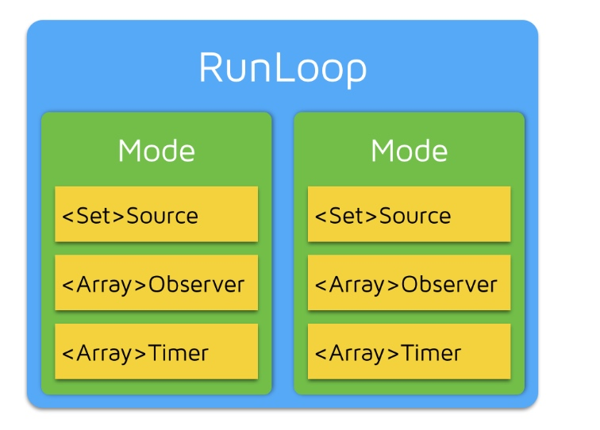
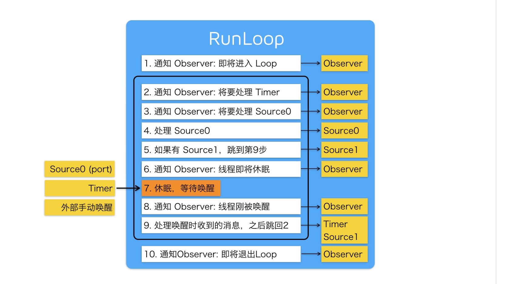

# RunLoop

+ 顾名思义 RunLoop， 就是一个在Run的loop，就是一个一直在跑的圈。其本质就是无休止的while循环。一般的程序都是执行完任务后便结束。但由于手机应用的特殊性，在其不执行任务时，也不能将其杀死，而是暂时休眠状态，直到有外部或内部因素将其唤醒，继续run。直到用户手动将该程序彻底关闭。
+ 这种模型通常被称作 Event Loop。 Event Loop 在很多系统和框架里都有实现，比如 Node.js 的事件处理，比如 Windows 程序的消息循环，再比如 OSX/iOS 里的 RunLoop。实现这种模型的关键点在于：如何管理事件/消息，如何让线程在没有处理消息时休眠以避免资源占用、在有消息到来时立刻被唤醒。
+ RunLoop 实际上就是一个对象，这个对象管理了其需要处理的事件和消息，并提供了一个入口函数来执行上面 Event Loop 的逻辑。线程执行了这个函数后，就会一直处于这个函数内部 “接受消息->等待->处理” 的循环中，直到这个循环结束（比如传入 quit 的消息），函数返回。

+ 不是由应用程序创建，线程对象会根据需求自身去创建它。
+ 不是线程安全的，其方法只适用当前线程的上下文，所以不建议多线程适用。否者会出问题？？
+ NSRunLoop 是基于 CFRunLoopRef 的封装，提供了面向对象的 API，但是这些 API 不是线
  程安全的。（CFRunLoopRef 是在 CoreFoundation 框架内的，它提供了纯 C 函数的 
  API，所有这些 API 都是线程安全的。）
+ 不能主动杀死，只能暂时休眠

**CFRunLoop**

CFRunloop 控制2个内容： 输入源和分派已处理的任务,并且提供 3 中类型的对象监视 RunLoop。

数据源对象：CFRunLoopSource
计时器对象：CFRunLoopTimer
观察者对象：CFRunLoopObserver

~~~
输入源

user input device（用户输入设备）
network connections（网络连接）
periodic or time-delayed events（周期或时滞事件）
asynchronous callbacks（异步回调）
~~~

实现这种模型的关键点在于：如何管理事件/消息，如何让线程在没有处理消息时休眠以避免资源占用、在有消息到来时立刻被唤醒。


### RunLoop 底层

1. 以全局字典方式存储。key 是 thread， value 是 runloop。
2. 5 个概念 runloop、runloopmode、runloop source、runloop time 和 runloopobserver，之间的关系如下：




observer 可观察的几个状态

```Objective-C 
typedef CF_OPTIONS(CFOptionFlags, CFRunLoopActivity) {
    kCFRunLoopEntry         = (1UL << 0), // 即将进入Loop
    kCFRunLoopBeforeTimers  = (1UL << 1), // 即将处理 Timer
    kCFRunLoopBeforeSources = (1UL << 2), // 即将处理 Source
    kCFRunLoopBeforeWaiting = (1UL << 5), // 即将进入休眠
    kCFRunLoopAfterWaiting  = (1UL << 6), // 刚从休眠中唤醒
    kCFRunLoopExit          = (1UL << 7), // 即将退出Loop
};
```


### RunLoop 逻辑




### 注意点

* 线程与 RunLoop 关系：1：1 或者 0：1（runloop 的创建是懒加载的方式，只有在主动调用 currentRunLoop 的情况下去创建，并在线程结束的时候销毁它）
* 你只能在一个线程的内部获取其 RunLoop（主线程除外）。
* 对于一个 RunLoop 来说，其内部的 mode 只能增加不能删除。


