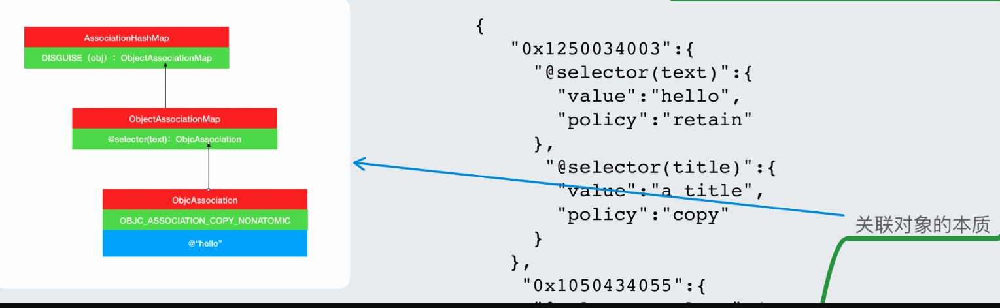

# extension

**理解重点：明白添加分类的原理和过程（主要是在运行时调用方法的流程）？**~~~~

1. 为什么分类不能添加实例变量（存储属性）？

    ```
        1. 明白分类添加方法的原理。（主要是在运行时添加方法，具体过程需要详细了解）
        2. 原因：因为在运行期，对象的内存布局已经确定，如果添加实例变量（需要的讲解类结构）那么会影响类在内存上的布局，这对编译器语言是灾难性的。（个人理解如果可以添加属性，那么需要做的事情动态修改内存，但是我们所有的编译又是依赖内存的，所以改动代价太大，实现起来也是复杂性的）
    ```

2. 分类的查找顺序？

    ```
    分类 -> 原类 -> 父类
    ```

3. 关联对象的本质是什么？

    


