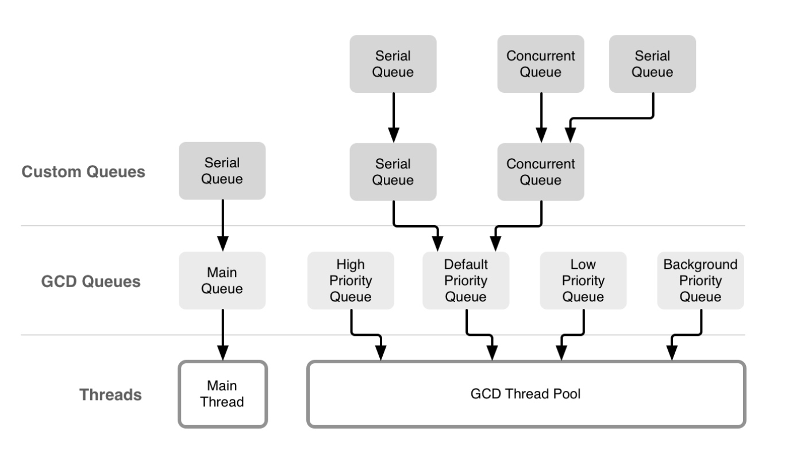

# 深入 GCD 笔记

1. 向任何队列中提交的 block，都会被放到它的目标队列中执行，而普通串行队列的目标队列就是一个支持 overcommit 的全局队列，全局队列的底层则是一个线程池。(带有 overcommit 的队列表示每当有任务提交时，系统都会新开一个线程处理，这样就不会造成某个线程过载(overcommit)。) --- 问题：根据上面的内容串行队列都是全局队列，那为什么在添加任务时没有创建新的线程？理解：原因是串行队列的并发数是 1 ，不可能出现同一时间有两个任务出现的情况，也就不会出现有 2 个线程的情况。

2. 队列与线程的关系图：

    

3. 队列其实就是一个用来提交 block 的对象，当 block 提交到队列中后，将按照 “先入先出(FIFO)” 的顺序进行处理。系统在 GCD 的底层会维护一个线程池，用来执行这些 block。

