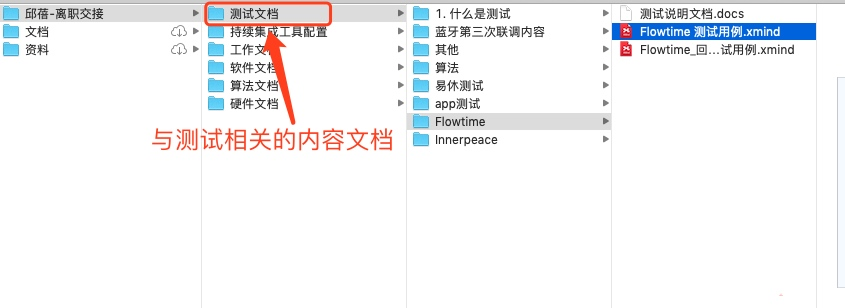
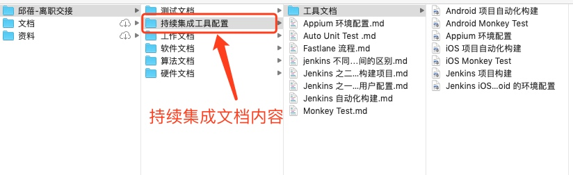

# 邱蓓离职清单

## 工程项目

1. 主工程项目： `Naptime_iOS`、 `Innerpeace_iO`S 和 `Flowtime_iOS`。工程已经全部移交给励可了。
2. 开发类 SDK
    
    - `EnterAffectiveCloud` SDK: `Flowtime` 和 `CSDemo` 已经集成，已经测试。目前项目已经交接给励可。
    - `Enter-Biomodule-BLE-iOS-SDK`（需要自己维护，通过 `TestFlight` 分发）、`FileProtocol_iOS` 和 `iOSDFULibrary` 目前主要维护的 SDK 已经移交给励可。
    - 其他 SDK：包含了算法相关的 SDK、三电极的 `BLETool` 和 `EnterKit-iOS` (自己的工具库)。

3. 其他项目

    - `FactoryV3` 工装测试 app。需要维护，通过 `TestFlight` 分发，用于三电极产品的工装测试使用。已经移交给励可。
    - `CSDemo` app，情感云展示 app，需要维护，通过 `TestFlight` 分发。已经移交给励可。
    
    陌生工程说明：
    
    `PodSpecs`： 自己的 Cocospods 私有仓库。用户管理自己制作的 pod 库。
    `ACDocuments`: 硬件开发文档仓库。
    `certificate`: ios 证书管理仓库， fastlane 自动化集成中使用。
    `TestReport`: 测试文档仓库，当中存放于测试相关的文档。
    `iOSDFULibrary`: 实现固件更新的开发库，从芯片厂商 fork，需要自己维护 UUID，注意 swift 版本升级。
    
## 测试文档

测试文档包含我之前做测试的一些测试文档内容，其中大部分内容可能与 `TestReport` 仓库重复。

### 结构

## 持续集成

这类内容主要包含了与持续集成有关的工具的内容。

### 结构

## 其他

- 证书相关：已经向励可交接。

