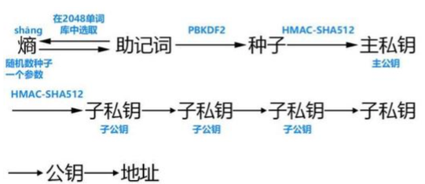

# Hiwallet 登录注册文档整理

## 注册

App 目前采用助记词的方式注册，方式有两种：一种是之前已经有助记词，可以通过`导入助记词`的方式；另一种是`创建钱包`，由 App 生成一个新的助记词。之后根据`分层确定性钱包（HD）` 中 `BIP 39` 和 `BIP 44` 的提案生成钱包。

- `导入助记词`（已经有助记词的情况，目前只支持 12 单词的助记词）：输入助记词后进入设置 Pin 码页面，用户输入 Pin 码（6 位 [ 0 ~ 9 ] 的数字）作为之后验证操作的密码，设置成功后底层创建 HD 钱包然后进入首页。
- `创建钱包`：本地创建助记词，然后输入 Pin 码（6 位 [ 0 ~ 9 ] 的数字）作为之后验证操作的密码，设置成功后底层创建 HD 钱包然后进入首页。

## 登录

App 的登录的方式相对简单，目前支持两种方式：

1. 一种是通过上面设置的 6 位 `PIN 码` 作为密码输入，输入正确即可登录成功。
2. 另一种是通过 `面容`或者`指纹`方式登录。生物信息合法即可登录。

## 创建 HD 钱包

 
 钱包从 `助记词` 到 `地址`过程：
 
 `助记词` -> `私钥` -> `公钥` -> `地址`
 
 创建钱包的过程可以看作由分层确定性钱包的`助记词`生成`钱包`的过程：
 
 0. `随机熵` 生成 128 随机数，然后通过特定规则生成 12 个 `助记词` (SecRandomCopyBytes（生成随机熵)）
 1. `助记词` 生成 `种子`（Crypto.PBKDF2SHA512）。
 2. `种子` 生成 `私钥`（Crypto.HMACSHA512）。
 3. `私钥` 到 `公钥`。（椭圆曲线 EllipticCurveEncrypterSecp256k1()）
 4. `公钥` 再到 `地址`。（BTC：RIPEMD160，ETC： Crypto.sha3keccak256）
 5. 基于 `BIP 44` 提案生成 `钱包`。（主链、私钥、地址和 account Index）

> BIP 44：  m/44/coin/account/change/address_index

上面生成的`钱包`会映射到加密数据库。在默认的情况，我们会为用户创建 3 个钱包：一个 `BTC`钱包、 一个 `ETH` 钱包、一个 `ERC20` 的 `Top` 代币钱包。

## Hiwallet 存储结构整理

`Hiwallet` 的持久化数据分为两部分内容：一部分包含 App 的用户的信息（不加密数据）；另一部分包含的区块链钱包的信息（加密数据）。 

### `Hiwallet` 的用户的信息（不加密数据）

`Hiwallet` 不加密存储的内容主要对用户不敏感的数据，包含一些业务缓存数据和 App 偏好设置数据。`Hiwallet` 主要包含两类：数据库数据和文件数据。

**数据库**

像传统的 App 的一样，`Hiwallet` 也有类似用户的概念，只不过这个用户不是通过后台维护，而只在本地维护；在第一次【导入助记词】或者【创建助记词】时，本地会生成一个不加密的数据库并创建一张`用户表`生成一条`用户记录`，在用户【删除钱包】时，清除用户记录和数据，删除数据库。

这个`不加密的数据`主要存储的是不敏感的用户的信息，包含 `App 用户信息`、`热门币信息`、`通知信息`以及 `交易信息`。

`App 用户信息`储存了用户的基本信息和用户偏好数据，详情见下：

| 内容说明 | 字段 |
| :--: |:--:|
|用户名字| name |
|用户头像| icon |
|加密数据库密钥信息（类似公钥）| passwordHash |
|是否开启生物识别登陆| biometricLogin  |
|是否开启生物支付| biometricPay |
|...|...|

`通知信息`以及 `交易信息`主要是业务相关的，不包含特别的敏感信息，这里不详情描述，请参考具体业务需求。

**文件**

`Hiwallet` 存储的缓存文件主要是关于币价的信息.

### 区块链钱包（加密数据）

`Hiwallet` 中加密的数据主要是敏感数据(`钱包数据`、`备份数据`和`区块链用户数据`)。

**钱包数据**

这类数据包含的是币钱包的数据，像私钥、余额等之类数据。

- 钱包 （主币和代币）

	| 内容说明 | 字段 |
	| :--: |:--:|
	| 代币信息（代币特有）| token |
	|钱包别名| name |
	|`BIN 44` Account Index| accountIndex |
	| 钱包私钥 | privateKey |
	| 钱包地址 | address  |
	| 钱包余额 | lastBalance |
	| 钱包打开的状态 | hidden |
	|...|...|
	
- 代币信息

	| 内容说明 | 字段 |
	| :--: |:--:|
	| 合约地址 | address |
	| 代币符号或简称 | symbol |
	| 代币全名 | fullName |
	| 代币余额最小精度 | decimals |
	| 代币 icon 的链接 | iconUrl |
	| 代币浏览器 | webURL  |
	| 主链 | chainType |

**备份数据**

KeyStore 数据，目前暂时没用～

**区块链用户数据**

`区块链用户数据` 和上面的 `Hiwallet 的用户的信息` 合起来可以理解成传统 App 中的用户信息。`区块链用户数据` 包含的是用户加密的信息，像登陆钱包的种子、助记词和根私钥等。

