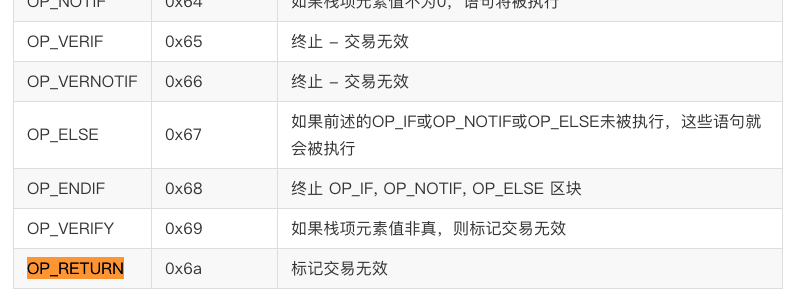
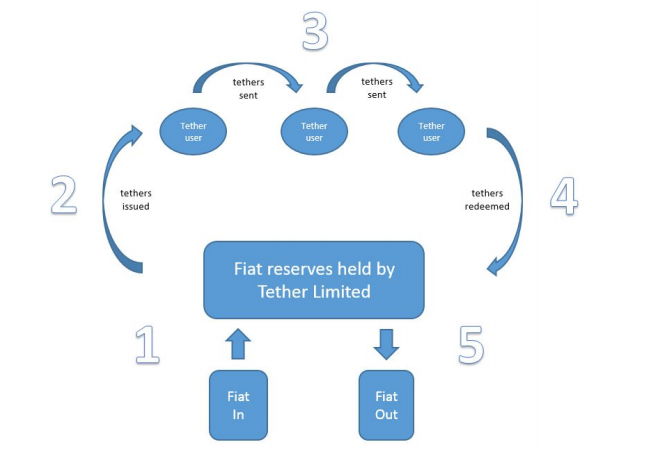

# USDT 调研

USDT 目前发行了两种代币，一种是基于以太坊标准的 RC20 Token，另一种是基于 Omni Layer 协议的代币，在 omni 上，USDT 代币 ID 为 31.

## 调研目标

1. usdt 是什么？
2. usdt 地址、交易的过程，并调研是否有第三方接口（重点）。
3. 与其他币的的兑换过程，重点是在 api 层。

## 基于 Omni Layer 协议的 USDT 理论内容

### 特点

1. 是在比特币区块链上发布的基于 Omni Layer 协议的数字资产（可以理解为比特币的代币）。
2. USDT 最大的特点是，它与同数量的美元是等值的，在泰达币交易平台上可以互相赎买（`Tether Limited 服务条款`）。
3. 人们能够通过许可 Omni Layer 协议的钱包转移、贮存和消费泰达币。
4. 泰达币不收任何交易费（或者费用非常低），不过第三方钱包和交易平台有可能收取。

### Tether Limited 服务条款

凭借 Tether Limited 的服务条款，持有人可以将 Tethers 与其等值法定货币赎回/兑换，或兑换成 Bitcoin。 Tether 的价格永远与法定货币的价格挂钩，其挂钩发币的储存量也永远大于或等于流通中的币量。在技术方面，继续遵从比特币区块链的特点与功能。

### Omni Layer

omni 协议一种通信协议，它以比特币网络为基础，在比特币网络上搭建 Omni Layer 共识网络，依靠这个在比特币网络外部的 Omni Layer 实现智能合约，用户货币和分散式点对点交易等功能。我们可以通过 omni 协议实现基于比特币网络的代币发行，这些代币不需要依赖于比特币网络无关的外部关系，可以直接通过比特币网络进行交易，在这一点上与基于以太坊网络发行的代币类似。

### OP_TETURN

OP_TETURN 是比特币脚本语言中的一条指令，表示结束当前栈的内容。

omni 协议提供高效而简单创建 token 的功能，而它的这个功能则是基于**比特币网络的 Op-Return 功能**来实现的。

参考链接：https://bitcoin.stackexchange.com/questions/29554/explanation-of-what-an-op-return-transaction-looks-like

~~~
UniValue omni_createpayload_simplesend(const UniValue& params, bool fHelp)
{
   if (fHelp || params.size() != 2)
        throw runtime_error(
            "omni_createpayload_simplesend propertyid \"amount\"\n"

            "\nCreate the payload for a simple send transaction.\n"

            "\nArguments:\n"
            "1. propertyid           (number, required) the identifier of the tokens to send\n"
            "2. amount               (string, required) the amount to send\n"

            "\nResult:\n"
            "\"payload\"             (string) the hex-encoded payload\n"

            "\nExamples:\n"
            + HelpExampleCli("omni_createpayload_simplesend", "1 \"100.0\"")
            + HelpExampleRpc("omni_createpayload_simplesend", "1, \"100.0\"")
        );

    uint32_t propertyId = ParsePropertyId(params[0]);
    RequireExistingProperty(propertyId);
    int64_t amount = ParseAmount(params[1], isPropertyDivisible(propertyId));

    std::vector<unsigned char> payload = CreatePayload_SimpleSend(propertyId, amount);

    return HexStr(payload.begin(), payload.end());
}

std::vector<unsigned char> CreatePayload_SimpleSend(uint32_t propertyId, uint64_t amount)
{
    std::vector<unsigned char> payload;
    
    // 定制 Op-Return 的内容，也就是基于 Omni 协议的生成代币信息。
    uint16_t messageType = 0;
    uint16_t messageVer = 0;
    mastercore::swapByteOrder16(messageType);
    mastercore::swapByteOrder16(messageVer);
    mastercore::swapByteOrder32(propertyId);
    mastercore::swapByteOrder64(amount);

    PUSH_BACK_BYTES(payload, messageVer);
    PUSH_BACK_BYTES(payload, messageType);
    PUSH_BACK_BYTES(payload, propertyId);
    PUSH_BACK_BYTES(payload, amount);

    return payload;
}
~~~

**omni 协议格式说明：**

~~~
6f6d6e69 : "omni" 的ASCII编码, 表示这个备注信息是与 Omni 协议有关系的. (4 Bytes) 这个是固定的。
0000 : Transaction Type (2 Bytes)
0000 : Transaction Version (2 Bytes)
0000001f : Currency Identifier (4 Bytes). 例子：1f== 31 == TetherUS
0000000b0f387b00 : Amount to transfer(8 Bytes). 例子：数量的十六进制0000000b0f387b00 = 47500000000聪 = 475 USDT
~~~

## USDT 

### 结构



每层的概要如下：

1. 第一层是比特币区块链。 Tether 交易分类账嵌入在比特币中通过嵌入式共识系统 Omni 将区块链作为元数据。
2. 第二层是 Omni 层协议。 Omni是一项基础技术，可以：

	* 授予（创建）和撤销（销毁）表示为嵌入其中的元数据的数字令牌在这种情况下，比特币区块链是固定的数字令牌，Tether。
	* 通过Omnichest.info（Omni 资产ID＃31，用于例如，代表 TetherUSD）和 Omnicore API。
	* 使用户能够在以下情况中进行交易和存储 Tether 和其他资产/令牌：
	
		- p2p，伪匿名，密码安全的环境。
		- 开源，基于浏览器的加密网络钱包：Omni Wallet。
		- 多重签名和离线冷库支持系统
		
3. 第三层是 Tether Limited，我们的业务实体主要负责：

	* 接受法定存款并发行相应的 Tether
	* 发送法定提款并撤销相应的 Tether
	* 保管流通中所有 Tether 的法定储备金

### USDT 流通生命周期

 

`步骤1` ­用户将法定货币存入 Tether Limited 的银行帐户。

`步骤2­` Tether Limited 生成并记入用户的 Tether 帐户。Tether 进入循环。用户存入的法定货币数量 = 向用户发行的 Tether 数量（即，存入的1 USD = 已发行的1 tether USD）。

`步骤3` ­用户与 Tether 进行交易。 用户可以通过基于开源、伪匿名以及基于比特币的 p2p 平台来传输、交换和存储 Tether。

`步骤4` ­用户将 Tether Limited 存放在 Tether 中，以兑换为法定货币。

`步骤5­ ` Tether Limited 销毁了 Tether 并将法定货币发送到用户的银行帐户。

### USDT 共识机制 - PoR（Proof of Reserves - 储备证明）

由 Tether Limited 内容我们知道，Tether 发行了多少数量的 USDT 就会有对应的 USD 的。这里就存在一个一致性问题：发行量和储备量。所以就有了 PoR 共识机制，它由两部分构成

* 发行的 USDT  量，由于是基于比特币的特性，我们可以计算发行的量。
* 通过审计公开存储在银行里 USD 的量，法币储备量。（有风险：审计的严谨性，以及存入银行是否会挪用）

### 思考

1. 讲了这么多有什么用，什么是 USDT 呢？
2. USDT 和比特币之间的联系是什么？
3. 代码结构。

## USDT 实践

### 目标

1. 找到是否有开源的 USDT 节点？

	测试节点： `https://api.omniexplorer.info/#request-v1-address-addr`
	
2. USDT 地址生成、获取交易列表和发送交易。

	解读 omni layer api。
	
	`1. 获取代币交易列表`
	
	~~~
	POST /v1/transaction/address HTTP/1.1
	Host: api.omniexplorer.info
	Content-Type: application/x-www-form-urlencoded
	Content-Type: application/x-www-form-urlencoded
	addr=1EXoDusjGwvnjZUyKkxZ4UHEf77z6A5S4P&page=0
	~~~
	
	`2. 发送交易列表`
	
	~~~
	POST /v1/transaction/pushtx/ HTTP/1.1
	Host: api.omniexplorer.info
	Content-Type: application/x-www-form-urlencoded
	Content-Type: application/x-www-form-urlencoded
	signedTransaction=01000000010b7ad3946c6fcd15d39fd4312c4f8dfd68c51a61071c2575cfb0722c4403eef1000000008a47304402206fe4eabf81cc4c6c3cee3dedc6ea9be46bb685c1b61da577bb9aead8188b80b702201404284c52ad2e857bd3931fb0e1646575d1e72c93b2cdcd80a7e0c7bee1c191014104ad90e5b6bc86b3ec7fac2c5fbda7423fc8ef0d58df594c773fa05e2c281b2bfe877677c668bd13603944e34f4818ee03cadd81a88542b8b4d5431264180e2c28ffffffff0470170000000000001976a9143b0000000000000001000000009d828d9600000088ac70170000000000001976a9143c791cc99255509d85788e2bf0e0f6e8b389b3cf88ac40355d5f000000001976a914946cb2e08075bcbaf157e47bcb67eb2b2339d24288ac70170000000000001976a914946cb2e08075bcbaf157e47bcb67eb2b2339d24288ac00000000
	~~~
	
	`3. 交易列表详情`
	
	~~~
	GET /v1/transaction/tx/e0e3749f4855c341b5139cdcbb4c6b492fcc09c49021b8b15462872b4ba69d1b HTTP/1.1
	Host: api.omniexplorer.info
	Content-Type: application/x-www-form-urlencoded
	~~~
	
	`参考资料`
	
	https://github.com/penghuangit/usdtwallet/blob/master/index.js