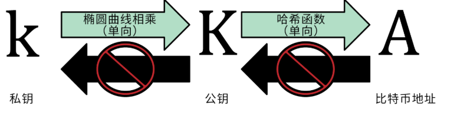
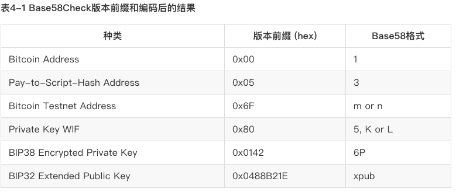

# 密钥、地址和钱包名词说明

首先我们大致了解一下比特币生成地址的过程，`地址`是由`私钥`生成，具体的生成过程如下所示：

> 但是什么是 `私钥` ？什么是 `地址` ？什么又是 `助记词` 呢？
> 说明上面名词之前，先知道下面几种编码。

**各种编码格式的取值范围**

* 二进制： 由 ` 0 和 1` 组成的一串数据。如：`1010` 表示的是 10 这个数据的二进制数据。
* 十进制：由 `1 ~ 10` 的数字组成一串数据。如：`1234988` 这个数据我们可以把它称之为一个 `十进制` 数。
* 十六进制: 由 `1 ~10 ,a ~ f` 组成的一串数据（一般 `十六进制` 以 0x 开头）。 如：`0x1b1234efc7768d` 是一个 `十六进制` 数。
* base64：由 `26 个小写字母、26 个大写字母、10 个数字以及两个符号（例如“+”和“/”）`组成一串位的数据。
* base58: `Base58 不含 Base64 中的 （数字0）、O（大写字母o）、l（小写字母L）、I（大写字母i），以及“+”和“/”两个字符。` 一般`比特币`的地址格式就是 `Base 58` 的：如 `1PRTTaJesdNovgne6Ehcdu1fpEdX7913CK`

下面我们对几个名词做一些说明：

## 比特币钱包

任何一个钱包，对用户而言，有两个基本的组成部分，公钥和私钥。为了方便理解，我们可以简单的将他们对应为，`地址` = `账号` = `转账地址`，`私钥` = `密码` = `身份认证`。尽管有些不同，但是这是最方便理解的说明。
然而跟传统的账号密码不同，这个账号，既是你身份也是你收款的地址，却并不具备你个人的任何信息，而密码，则能够证明你对这个账号的所有权，且可以使用你的密码随时更换你的账号名称。因此不同点在于，并不是同时需要账号和密码才能使用账户。你的账号通常可以提供给任何人，他们也将使用你提供的账号给你进行资产的转移。而你的密码，则一定需要完美的保护起来，因为任何人都可能使用你的密码在任何地方获取并控制你的账户，转走你的资产。

**功能**

和现实的 `钱包` 功能很像，一个存放资产（现金或银行卡）的容器。 只不过资产的形式不一样而已，`普通钱包`存放的是现实中由 `中国人民银行`发行的人民币或者它的另一种载体 -- 银行卡；然后比特币钱包存储的是 `比特币`，或者像我们钱包（`Hiwallet`）支持多种币的钱包。

**表现形式**

* 客户端 App（Hiwallet、Imtoken）
* PC 钱包。各种币自己的钱包（一般只支持自己的币的钱包）。

> 非确定性（随机）钱包
> 在最早的一批比特币客户端中，钱包只是随机生成的私钥集合。这种类型的钱包被称作零型非确定钱包。

## 私钥

`私钥` = `密码` = `身份认证`

**功能**

`比特币私钥`可以理解成是打开钱包，获取钱包信息和操作的密码（类似现实的银行卡密码）。所以说私钥是一个很重要很重要的信息，一旦丢失你的你的`钱包`将永远打不开。理论上这个密码是不可能通过暴力破解个解开的，因为的取值空间很大，特别大，除非你自己泄漏不然一般是不可能被破解的。

**表现形式**

私钥就是一个随机选出的数字而已。私钥可以是 1 和 n-1 之间的任何数字，其中 n 是一个常数（n = 1.158 * 10^77，略小于2^256）。这个数据是一个 256 位的 `二进制` 数据，一般我们看到是通常是一个 `十六进制` 的 64 位数据，一般形式如下：

> 1E99423A4ED27608A15A2616A2B0E9E52CED330AC530EDCC32C8FFC6A526AEDD

## 公钥

`公钥` = `账号` = `转账地址`

你只要知道它是 `私钥` 到 `地址` 的一种中间状态，它是 `私钥` 生成，并且可以生成 `地址`，如上面可知。

> 通过椭圆曲线算法可以从私钥计算得到公钥，这是不可逆转的过程：K = k * G 。其中k是私钥，G是被称为生成点的常数点，而K是所得公钥。

## 地址

上面的 `公钥` 可理解成 `私钥` 的另一种表现形式。

`地址` = `账号` = `转账地址`

**功能**

是资产的的基本容器和载体，就像我们现实中的银行卡的卡号。

**表现形式**

> `Base58格式`有版本的、经过校验的格式，可以明确比特币数据编码的编码格式。

一般采用 `Base58` 编码格式生成的一串数据，具体格式如下。

> `版本(一个字节的版本字节) + （hash）数据 + 校验码（4 个字节）`
> 
> 1PRTTaJesdNovgne6Ehcdu1fpEdX7913CK

关于 `Base58Check` 的编码如下：

### 助记词

有助记词的整个流程可以理解成是这样一个过程：`随机种子` -> `助记词` -> `私钥` -> `公钥`-> `地址`

**功能**

助记词可以理解成是一种便于理解的密码形式，上面的 `1E99423A4ED27608A15A2616A2B0E9E52CED330AC530EDCC32C8FFC6A526AEDD` 这样一串毫无逻辑的长串字符仅仅靠脑力记忆却是不方便；为了便于记忆有了基于多位的单词（或者其他不同语言词汇）的密码方式。

**表现形式**

下面是一个 12 个单词的助记词形式：

> "caution", "another", "retire", "unfold", "lizard", "figure", "yellow", "blossom",  "increase", "jazz",  "obtain", "parent"

